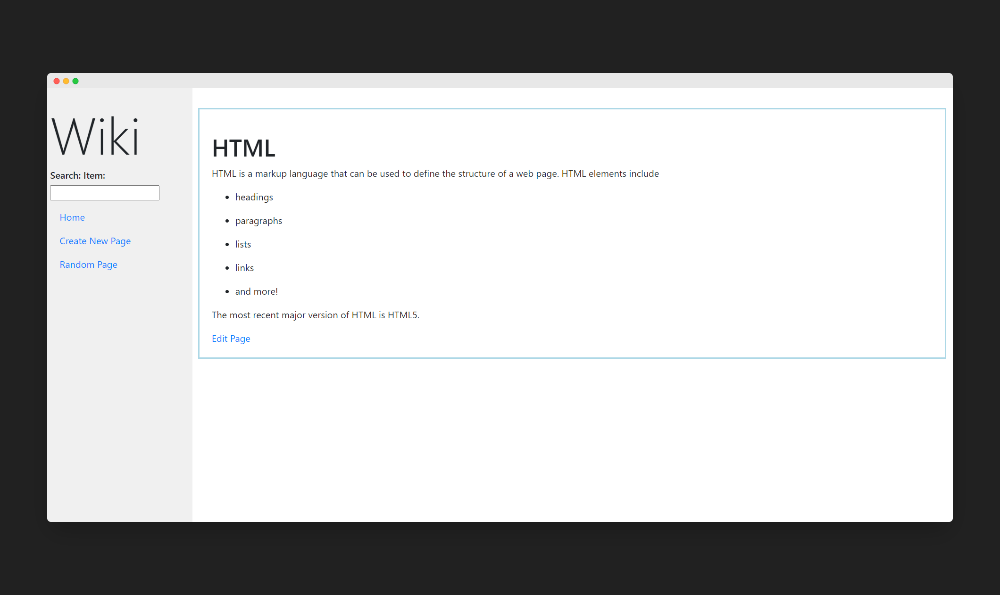

# Wiki Lookalike
 
 
ScreenShots :
-------------

    
 

 
 
 
 
Desinged a dynamic website that functions and looks alike of wikipedia.
-----------------------------------------------------------------------

Markdown to HTML Conversion: On each entry’s page, any Markdown content in the entry file is converted to HTML before being displayed to the user. Used the python-markdown2 package to perform this conversion, installable via pip3 install markdown2.

To run download or git clone the repository
*Go to the Root of the repository*
*Run the command*
`py runserver manage.py`
